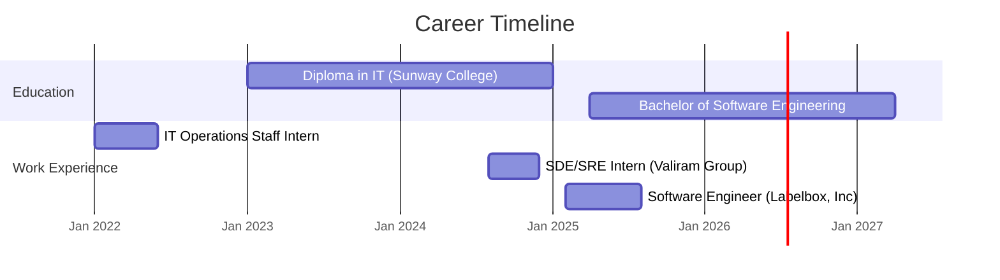

# Nathan Aldyth Prananta Ginting

  
  
  
  
  

  
  

## 👨‍💻 About Me

18-year-old software engineer with a unique journey from music student to tech innovator. Currently balancing education with professional engineering work, while creating open-source tools that are making an impact in the developer community.

> "From composing musical harmonies to architecting elegant code solutions"

## 🚀 Career Highlights

- **Software Engineer (ML/AI Focus)** at **Labelbox, Inc** (Feb 2025 - Present)
  - Reduced API response times by 60% with Redis caching implementation
  - Improved AI model consistency by 40% with refined rating algorithms
  - Increased classification accuracy from 82% to 95% through hyperparameter tuning

- **SDE/SRE Intern** at **Valiram Group** (Aug 2024 - Dec 2024)
  - Reduced manual testing effort by 70% with automation frameworks
  - Improved CI/CD pipeline reliability from 75% to 89.5%
  - Enabled 800+ concurrent UI and API tests with hybrid execution approach

## 🔥 Current Projects

  <table>
    <tr>
      <td width="50%">
        <h3 align="center">Jangular-CLI</h3>
        

          
          
        

        
<strong>Spring Boot + Angular</strong> - A CLI tool that reached 9,000+ downloads, cutting setup time by 60% with pre-built authentication, migrations, and 15+ API & UI routes.

      </td>
      <td width="50%">
        <h3 align="center">DynamoSQL</h3>
        

          
        

        
<strong>TypeScript ORM</strong> - An upcoming project designed to bridge SQL developers and DynamoDB's learning curve, functioning as a Prisma-like ORM.

      </td>
    </tr>
    <tr>
      <td width="50%">
        <h3 align="center">Appetite Connect</h3>
        

          
        

        
<strong>Full-Stack Restaurant Management</strong> - Laravel API with JWT auth, Angular SPA with real-time updates, and Flutter Cashier App, reducing restaurant management time by 40%.

      </td>
      <td width="50%">
        <h3 align="center">Binary Trails</h3>
        

          
        

        
<strong>Developer Minigame</strong> - 10+ dynamic API challenges built with Nuxt.js 3, Flask, DynamoDB and AWS, featuring encrypted requests and progressive difficulty.

      </td>
    </tr>
  </table>

## 💼 Professional Experience

## 🛠️ Tech Stack

### Languages
 
 
 
 
 
 
 
 

### Frameworks & Libraries
 
 
 
 
 
 
 
 
 

### Databases & Cloud
 
 

  

### Tools & Platforms
 
 
 

## 📊 GitHub Stats

  

  
  

## 🎵 Beyond Coding

When I'm not coding, you'll find me:
- Sleeping
- Eating and Drinking tea
- Complaining

## 📫 Let's Connect

I'm always open to interesting collaborations and projects. Feel free to reach out!

- Email: nathangtgmy@gmail.com
- Website: [nathangtg.com](https://nathangtg.com)
- LinkedIn: [nathan-apg](https://linkedin.com/in/nathan-apg)

  

---

  Built with ❤️ by a music student turned tech enthusiast

