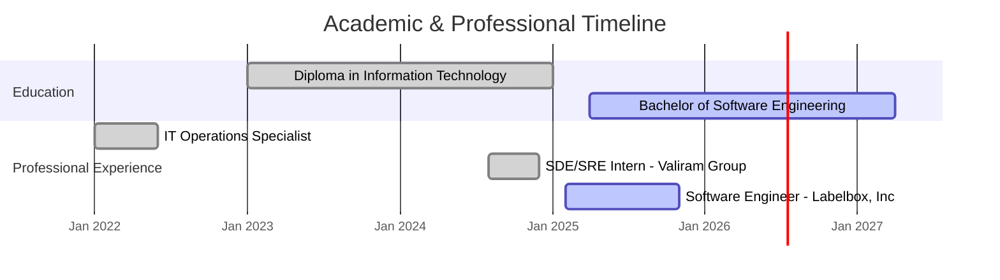

# Nathan G. - Software Engineer & ML/AI Specialist

  
  
  
  

  
  

## 👨‍💻 About Me

Passionate software engineer with proven experience delivering scalable solutions and open-source tools that impact thousands of developers. Currently pursuing advanced studies while contributing to enterprise-level ML/AI systems and maintaining popular developer tools.

**Current Focus:** Machine Learning Engineering, Full-Stack Development, Developer Tooling

---

## 🚀 Professional Experience

### **Software Engineer (ML/AI)** | Labelbox, Inc | *Feb 2025 - Present*
- **Performance Optimization:** Reduced API response times by 60% through strategic Redis caching implementation
- **ML Model Enhancement:** Improved AI model consistency by 40% with refined rating algorithms and hyperparameter optimization
- **Classification Accuracy:** Increased model accuracy from 82% to 95% through systematic tuning and validation

### **Software Development Engineer Intern** | Valiram Group | *Aug 2024 - Dec 2024*
- **Test Automation:** Reduced manual testing effort by 70% with comprehensive automation frameworks
- **DevOps Excellence:** Improved CI/CD pipeline reliability from 75% to 89.5%
- **Scalability:** Architected hybrid execution approach supporting 800+ concurrent UI and API tests

### **IT Operations Specialist** | *Jan 2022 - Jun 2022*
- Gained foundational experience in enterprise IT infrastructure and operations management

---

## 🛠 Featured Projects & Open Source Contributions

  <table>
    <tr>
      <td width="50%">
        <h3 align="center">🔧 Jangular-CLI</h3>
        

          
          
           
          
        

        
<strong>Spring Boot + Angular CLI Tool</strong> 
        📈 <strong>51,000+ downloads</strong> | Reduces project setup time by 60% 
        ✨ Pre-configured authentication, database migrations, and 15+ API routes 
        🎯 Streamlines full-stack development workflow

      </td>
      <td width="50%">
        <h3 align="center">🤖 AgentHub</h3>
        

          
          
        

        
<strong>AI Agent Orchestration Platform</strong> 
        🧠 Centralized AI agent creation and management 
        ⚡ Built with Next.js, TypeScript, and LangChain 
        🔄 Simplifies AI workflow scaling and deployment

      </td>
    </tr>
    <tr>
      <td width="50%">
        <h3 align="center">🍽️ Appetite Connect</h3>
        

          
          
          
        

        
<strong>Enterprise Restaurant Management System</strong> 
        🏗️ Microservices architecture with Laravel API 
        📱 Cross-platform with Angular SPA and Flutter mobile app 
        ⏱️ Reduces restaurant management overhead by 40%

      </td>
      <td width="50%">
        <h3 align="center">🎮 Binary Trails</h3>
        

          
        

        
<strong>Interactive Developer Challenge Platform</strong> 
        🧩 10+ dynamic API challenges with progressive difficulty 
        🔐 Features encrypted requests and real-time validation 
        ☁️ Deployed on AWS with DynamoDB and Flask backend

      </td>
    </tr>
  </table>

---

## 📚 Education & Certifications

**Current:** Bachelor of Software Engineering  
*Sunway University - Lancaster University* | 2025-2027

**Completed:** Diploma in Information Technology  
*Sunway College* | 2023-2025

---

## 💻 Technical Expertise

### **Languages**

### **Frameworks & Technologies**

### **Cloud & Infrastructure**

### **Databases**

---

## 📊 GitHub Analytics

  

  

---

## 🎯 Key Achievements

- 📦 **51,000+ NPM downloads** for open-source CLI tool
- ⚡ **60% performance improvement** in enterprise API systems
- 🤖 **40% enhancement** in ML model consistency
- 🎯 **95% classification accuracy** achieved through systematic optimization
- 🚀 **70% reduction** in manual testing processes
- 📈 **89.5% CI/CD reliability** improvement

---

## 🤝 Let's Collaborate

I'm always interested in challenging projects, innovative collaborations, and opportunities to contribute to meaningful software solutions.

**Open to:** Full-time opportunities, consulting projects, open-source collaborations

  

  

---

  Building the future, one commit at a time

